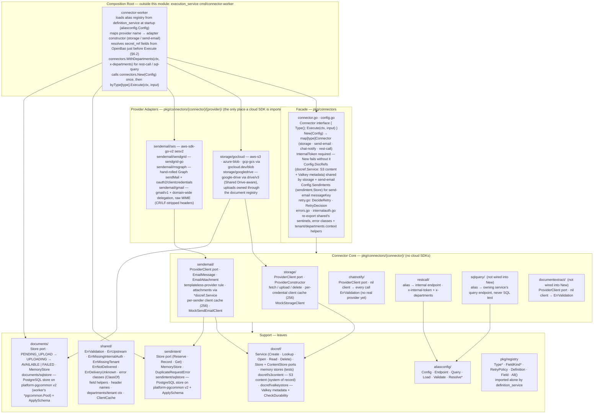
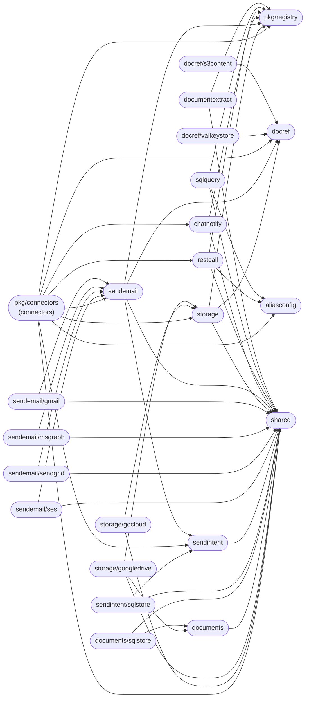
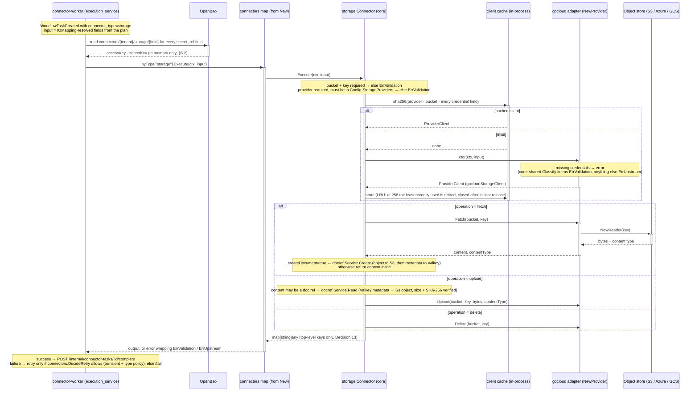
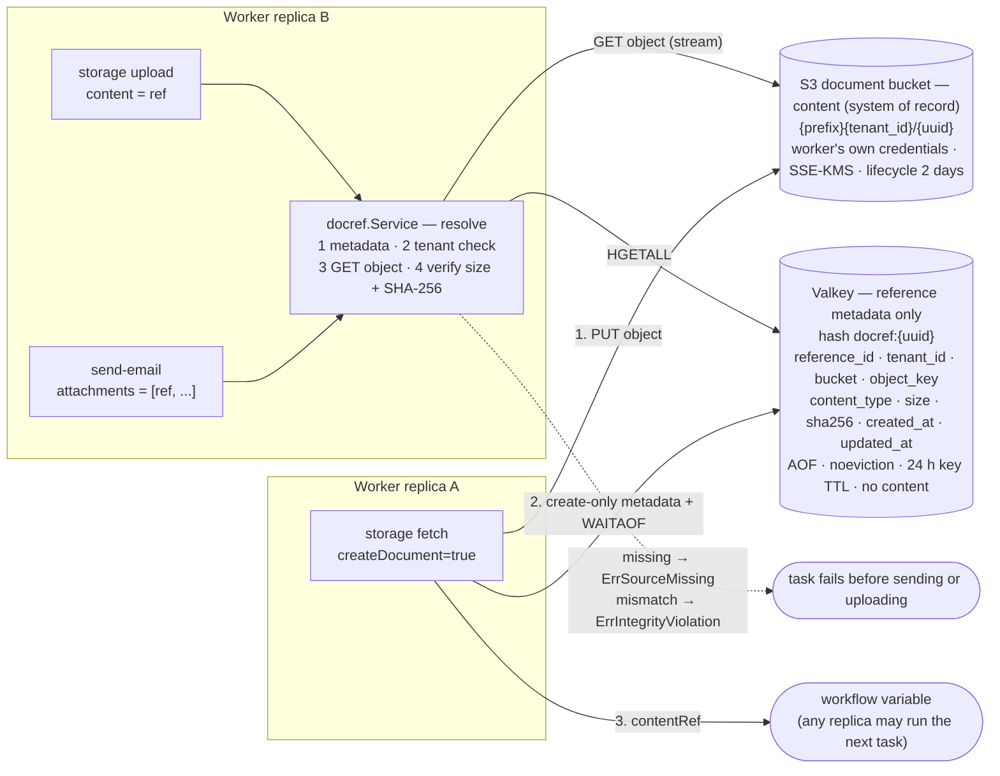
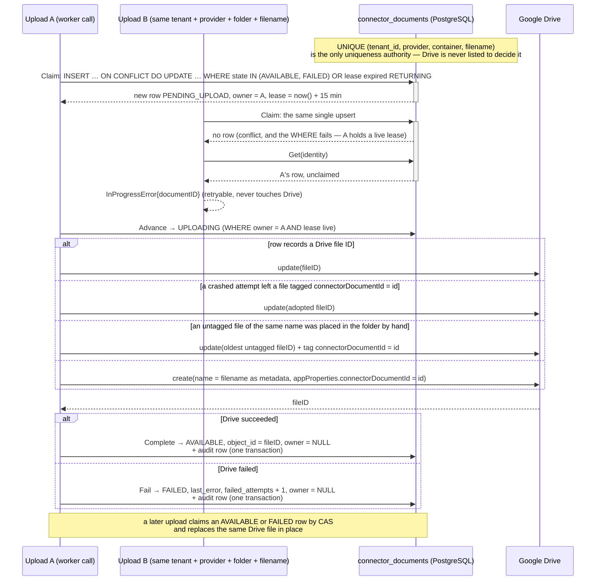
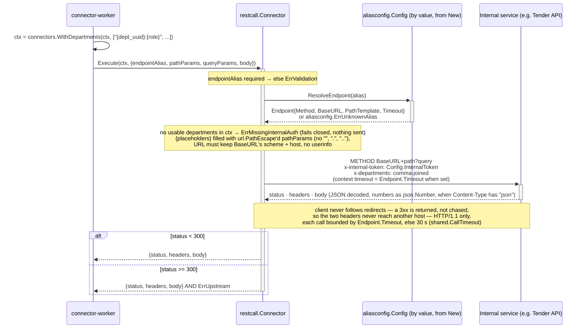
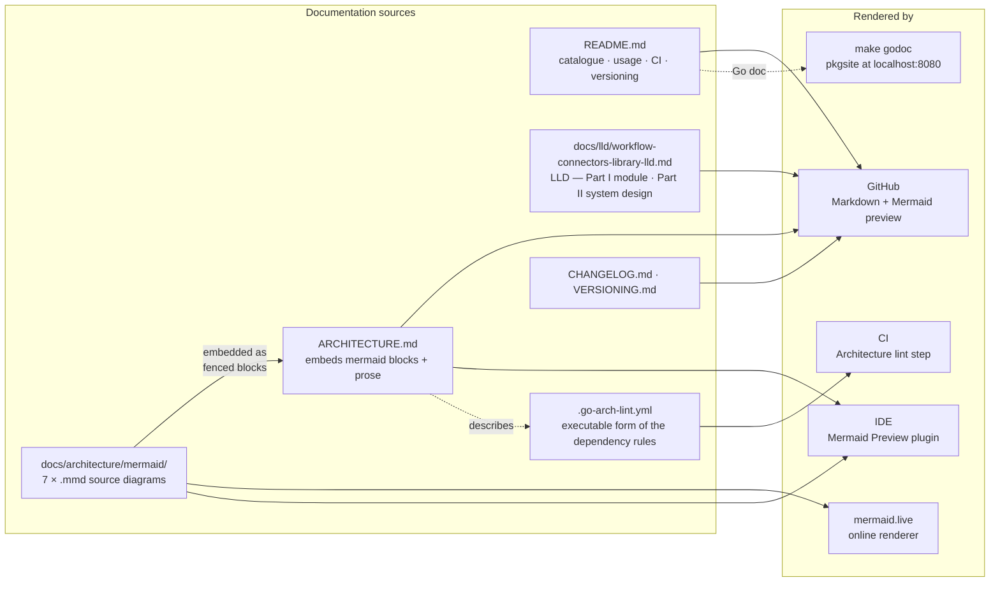

# Architecture

This document describes the internal structure, dependency rules, and runtime data flows of `workflow-connectors`.

`workflow-connectors` is a **private Go library** (`github.com/BCBP-SOLUTIONS-FZC-LLC/workflow-connectors/v2`, Go 1.26.9), a `platform-libs`-style module alongside `platform-events`, `platform-gincommon` and `platform-pgcommon`, owned by the workflow team. It implements the connector catalogue of the **Automatic Connector Tasks & Connector Workers LLD** (Part II of `docs/lld/workflow-connectors-library-lld.md`, §S6): the small, fixed set of automatic BPMN service tasks (`connector:`-prefixed) that fetch, check or send something without a human acting on them. It ships **no binary, no image and no runtime of its own** — it is two packages consumed as ordinary module dependencies: `pkg/registry` (the type list and field shapes, imported by `definition_service` for its `UNKNOWN_CONNECTOR_TYPE` compile check and its authoring-template generator) and `pkg/connectors` (the `Execute` implementations, imported by `execution_service`'s `cmd/connector-worker`, which is this library's only runtime host).

**Owns:** the `Connector` interface (`Type()` + `Execute(ctx, input) (map[string]any, error)`); the connector catalogue's field definitions and per-type retry policy (`pkg/registry`); input validation and output shaping for every connector; the provider-client ports and their real SDK adapters for `storage` (`aws-s3`, `azure-blob`, `gcp-gcs`, `google-drive`) and `send-email` (`sendgrid`, `aws-ses`, `microsoft-365`, `google-workspace`); the alias schema `rest-call`/`sql-query` resolve against (`aliasconfig`); document-ref resolution (`docref.Service`: content in S3 via `docref/s3content`, metadata in Valkey via `docref/valkeystore`) that lets one connector's output feed another's input on any replica; the `x-internal-token` + `x-departments` header contract for internal calls.

**Does not own:** the connector worker process, its Valkey Stream consumption, dedup, leases, bounded pools, timeouts and retries, and the `/internal/connector-tasks/:id/{complete,fail}` callbacks (`execution_service`, LLD §S6.5); reading credentials from OpenBao — every secret arrives already resolved (`execution_service`'s worker, LLD §S6.2); writing, rotating and revoking credentials, and the alias registry's storage and allowlist (`definition_service`, LLD §S6.2 and §S10 Decision #21); BPMN compilation and the `connector:` task rule (`definition_service`); the DSL shape (`workflow-models`); logging, metrics, tracing and events (this module has none); a database of its own — the Drive document registry and send intents run on the worker's PostgreSQL, through the `*pgcommon.Pool` the worker passes in — platform-pgcommon, the same database layer every service uses.

---

## Layer model

The module is organised as a connector **core** per connector type, surrounded by **provider adapters** that implement a core's `ProviderClient` port for one provider family (`storage/gocloud` covers S3, Azure Blob and GCS through gocloud.dev; `sendgrid` and `msgraph` are our own HTTP clients rather than vendor SDKs), with the composition root living outside the module in the worker. Inner layers have **zero knowledge** of outer layers; dependencies always point inward.

> Source: [`docs/architecture/mermaid/layer-model.mmd`](docs/architecture/mermaid/layer-model.mmd)

**Rule:** `registry`/`shared` ← `connector core` ← `provider adapters` ← worker (composition root, outside this module). `aliasconfig` is a leaf used by the two alias-based cores and the facade. The facade (`pkg/connectors`) depends on cores, `shared`, `aliasconfig`, `registry`, `sendintent` (the `SendIntents` port) and `docref` (the `DocRefs` service), **never on an adapter or a store implementation** — provider constructors are injected through `Config.StorageProviders` / `Config.SendEmailProviders`, keyed by provider name, so the worker decides which adapters exist. A connector core defines its own `ProviderClient` port and `ProviderConstructor`; an adapter imports its core to implement them, so the core never needs to know an adapter exists. The cores are therefore free of every cloud SDK: `storage` imports only `registry`, `shared` and `docref`; `sendemail` adds `sendintent` and `github.com/google/uuid`.

Every connector package imports `shared` and never the root `pkg/connectors`, so there is no import cycle; the root re-exports `shared`'s sentinel errors (`ErrValidation`, `ErrUpstream`, `ErrMissingInternalAuth`, `ErrMissingTenant`, `ErrNotDelivered`, `ErrDeliveryUnknown`), its error classes (`ErrorClass`, `ClassOf`, `IsTransient`, `IsPermanent`) and context helpers (`WithDepartments`, `DepartmentsFromContext`, `WithTenant`, `TenantFromContext`), and adds `DecideRetry`, so callers need only one import. Enforced in CI by `go-arch-lint` (`.go-arch-lint.yml`, run by `make arch-lint` and the **Architecture lint** step of `validate-quality.yml`). Unlike a service's config, which allows any vendor import everywhere, this one sets `depOnAnyVendor: false` and declares every third-party module per component: the core/adapter split exists precisely so that only adapters may import a cloud SDK, and the linter checks that, not just module-internal imports. `deepScan` is off — import-level checks only.

---

## Package dependency graph

Arrows represent Go `import` relationships (module-internal only) — this graph mirrors `.go-arch-lint.yml` component-by-component.

> Source: [`docs/architecture/mermaid/package-dependencies.mmd`](docs/architecture/mermaid/package-dependencies.mmd)

`pkg/registry` and `shared` are the dependency sinks: they have **no `deps` entry** in `.go-arch-lint.yml`, so they may import nothing from this module and no vendor module (only the standard library). `aliasconfig` may use `gopkg.in/yaml.v3` only. `connector_core` (`storage`, `sendemail`, `chatnotify`, `restcall`, `sqlquery`, `documentextract`) may depend on `registry`, `shared`, `aliasconfig`, `send_intents` (`sendintent`) and `docref`, and use `github.com/google/uuid`. `provider_adapters` may depend on `connector_core`, `documents` and `shared`, and are the only component allowed the `aws-sdk`, `azure-sdk`, `gocloud`, `google-api`, `oauth2` and `sendgrid` vendors. `connectors` (the facade) may depend on `connector_core`, `shared`, `aliasconfig`, `registry`, `send_intents` and `docref` — never on `provider_adapters` or a store implementation. `docref` may use `uuid` only; `documents` and `send_intents` may depend on `shared` (and use `uuid`); `document_sqlstore` and `send_intents_sqlstore` on their port, `shared` (error classes) and `pgcommon`; `docref_valkeystore` on `docref` and `valkey`; `docref_s3content` on `docref` and `aws-sdk`. `_test.go` files are excluded (`excludeFiles: '.*_test\.go$'`), so test-only imports such as `testify` and `gocloud.dev/blob/memblob` are outside the checked graph.

---

## Execution flow

Every connector call follows the same path: the worker resolves credentials, calls `Execute` on the connector `New` built for that type, and the core validates, picks or builds a provider client, and delegates the side effect to an adapter. `storage` is shown; `send-email` is the same shape with `Send` in place of `Fetch`/`Upload`/`Delete`.

> Source: [`docs/architecture/mermaid/execution-flow.mmd`](docs/architecture/mermaid/execution-flow.mmd)

**Construction.** `connectors.New(Config)` is called once per process. It fails if `InternalToken` is empty (rest-call attaches it to every request), hands `Config.DocRefs` (the document-ref service) to both `storage` and `send-email`, constructs `storage`, `send-email`, `chat-notify` and `rest-call`, and returns them keyed by `Type()`, panicking on a duplicate type — a programming error, not a runtime condition. `sql-query` and `document-extract` are implemented in their own packages but are neither wired into `New` nor listed in `registry.All()`.

**The secret-resolution boundary.** `Execute` receives already-**resolved** values for every field the registry marks `FieldKindSecretRef` — never an OpenBao path. The worker reads `connectors/<tenant>/<type>/<field>` for the job's own tenant immediately before the call (LLD §S6.2). OpenBao is therefore absent from this module's import graph, and connectors are testable with plain values. A secret field the tenant has stored nothing for arrives absent, and the adapter refuses it with an error naming the provider.

**Output.** `Execute` returns `map[string]any` whose top-level keys are what `IOMapping.Outputs.Source` can address — no nested or dot-path access in v1 (LLD §S10 Decision #13). The worker forwards that map to `execution_service` verbatim.

---

## Provider selection and client cache

`storage` and `send-email` are multi-provider. The caller always names one: `provider` is required, with no default, and a provider absent from `Config` is `ErrValidation`, never a fallback to a mock (LLD §S10 Decision #20).

| Connector | Cache key (sha256 over) | Why |
|---|---|---|
| `storage` | provider · `bucket` · every storage credential field (`accessKey`, `secretKey`, `region`, `azureAccountName`, `azureAccountKey`, `gcpServiceAccountKey`, `projectId`, `driveServiceAccountKey`) | Credentials are per tenant and resolved per call, so a client is reused only for an identical credential set |
| `send-email` | provider · `senderEmail` · every email credential field (`apiKey`, `accessKey`, `secretKey`, `region`, `tenantId`, `clientId`, `clientSecret`, `serviceAccountKey`) | `google-workspace` binds one impersonated mailbox (`jwtConfig.Subject`) at construction, so the same key sending as two senders must never share a client (LLD §S10 Decision #23) |

Each cache is a `shared.ClientCache`, capped at **256** entries, with reference-counted lifetimes. `Execute` acquires a handle and releases it when the call returns (`defer handle.Release()`), so a client is never closed under a running call. Reaching the cap evicts the least recently used entry; `ResetClients()` (for example after credential rotation) retires them all. A retired entry leaves the map at once, so new calls build fresh clients, and its client is closed — via `io.Closer`, exactly once — when its last handle is released, or immediately if none is out. A cached client is shared by concurrent calls, so it holds no per-call mutable state (the SendGrid adapter builds each request itself for this reason), and every provider HTTP client (`shared.ProviderHTTPClient`) never follows a redirect and speaks HTTP/1.1 only (Go's HTTP/2 client replays a POST after a `PROTOCOL_ERROR` reset). Construction happens outside the lock; when two calls miss the same key at once, the first stored client wins and the other is closed unused. Adapters with releasable resources implement `Close`: gocloud closes its bucket and its own S3 transport, SES, Gmail and Graph drop their idle connections. The cache is an optimisation only: any entry can be rebuilt from the call's own input.

`chat-notify` and `document-extract` take a single `ProviderClient`. With none, every call fails with `ErrValidation` rather than falling back to the in-memory mock, so a task never reports a message as sent when nothing was sent. They have no real provider yet, and their registry entries carry no `provider` field until one ships (LLD §S10 Decision #20).

---

## Document refs

A "document ref" is a plain opaque string (LLD §S10 Decision #14) that lets one connector's output become another's input without the bytes passing through the workflow's variables.

> Source: [`docs/architecture/mermaid/docref-flow.mmd`](docs/architecture/mermaid/docref-flow.mmd)

**S3 holds the content; Valkey holds only the reference.** A ref is a pointer to an S3 object, not a snapshot of it.

| | Store | Holds |
|---|---|---|
| Content | The platform's S3 document bucket (`docref/s3content`) — system of record for content | One object per ref at `<prefix><tenant_id>/<uuid>` |
| Metadata | Valkey (`docref/valkeystore`) | One hash per ref at `docref:{uuid}`: `reference_id`, `tenant_id`, `bucket`, `object_key`, `content_type`, `size`, `sha256`, `created_at`, `updated_at` — never content |

Valkey memory therefore grows with the number of refs (a few hundred bytes each), not with document size. Consumers never read content from Valkey: `storage` and `send-email` go through `docref.Service`, which `New` hands to both, so a ref fetched by `storage` resolves as a `send-email` attachment (pinned by `TestSendEmail_AttachmentFromStorage_ResolvesViaSharedDocRefs`).

**Write** (`Create`): object to S3 → SHA-256 computed → metadata to Valkey (atomic, create-only — a client retry after a lost reply that finds its own identical write succeeds — confirmed in the primary's AOF with `WAITAOF`, and optionally by `valkeystore.Options.WaitReplicas` replicas) → ref returned. A returned ref always points at an existing object; if the metadata write fails the object is deleted.

**Resolve** (`Open` streams, `Read` returns bytes up to a limit): metadata from Valkey (none → `ErrNotFound`) → tenant check: record tenant and bucket must match the caller and the object key must be exactly `<prefix><tenant_id>/<uuid>` for the ref's own ID, else `ErrIntegrityViolation` with no S3 request → object from S3 (none → `ErrSourceMissing`) → size checked before reading and SHA-256 at the end of the stream (mismatch → `ErrIntegrityViolation`). Every resolution is verified. All three are `ErrValidation` to the workflow and keep their `docref` sentinel for `errors.Is`; a Valkey or S3 outage is a retryable `ErrUpstream` (`storage`) or `ErrNotDelivered` (`send-email`, nothing sent).

**Consistency guarantees.**
- **Durable before visible.** Both writes complete before the ref is returned, so whichever replica runs the next task resolves it, and a Valkey restart replays the metadata from the AOF. No replica affinity.
- **Pointer, verified.** The metadata never changes after creation; the object can be overwritten or deleted in S3, but such a ref then fails resolution (`ErrIntegrityViolation`, `ErrSourceMissing`) — altered content is never served.
- **Tenant-scoped.** Checked from the metadata before any S3 request; another tenant's ref is `ErrNotFound`.
- **Expiring.** The metadata expires after 24 h (Valkey key TTL); the bucket's lifecycle rule removes objects after 2 days. `Delete` removes the ref, then the object.
- **Bounded memory.** `Open` streams and verifies as it goes; `send-email` and `storage` upload use `Read`, which refuses an oversize document from its metadata and verifies in full before sending or uploading.
- **Never evicted.** Valkey runs `appendonly yes`, `appendfsync always` (or `everysec`) and `maxmemory-policy noeviction`, verified at startup by `valkeystore.CheckDurability`. Bucket settings, IAM, retention and restore: [`docs/runbooks/document-refs.md`](docs/runbooks/document-refs.md).

`storage` creates a ref on a fetch or an upload of literal content with `createDocument: true`; an upload whose content is a ref re-uses that ref (its verified bytes). `send-email` names each attachment `attachment-N` plus an extension derived from the resolved content type (LLD §S10 Decision #22). Without `Config.DocRefs`, refs are disabled — `createDocument`, ref content and attachments are `ErrValidation` — rather than silently kept in worker memory. `docref.NewMemoryService` exists for unit tests only.

---

## Drive document registry

Google Drive cannot create a file "if absent": two uploads that each look for a file and then create one can both create it. So Drive never decides uniqueness. A row in `connector_documents`, unique per **tenant + provider + folder + filename** by a database constraint, decides which upload owns the document. Only the owner writes to Drive; files are then addressed by the Drive file ID recorded on the row, and the Drive file name is metadata only.

> Source: [`docs/architecture/mermaid/drive-upload-flow.mmd`](docs/architecture/mermaid/drive-upload-flow.mmd)

| State | Owned | Meaning | Leaves by |
|---|---|---|---|
| `PENDING_UPLOAD` | yes | Row inserted or taken over; the owner is about to write | `Advance → UPLOADING` (or `→ DELETING` for a delete) |
| `UPLOADING` | yes | The owner is writing to Drive | `Complete → AVAILABLE`, `Fail → FAILED` |
| `AVAILABLE` | no | The recorded Drive file holds the content | A new upload or delete claims it by CAS |
| `FAILED` | no | The last attempt failed; `last_error` and `failed_attempts` kept | A retry claims it by CAS and reuses the row and any recorded file |
| `DELETING` | yes | The owner is deleting the Drive file | `Remove` (row deleted) or `Fail` |

- **Claim, never check-then-create.** `Claim` is one upsert against `uq_connector_documents_identity`: `INSERT … ON CONFLICT … DO UPDATE … WHERE` the existing row is `AVAILABLE`/`FAILED` or its lease expired. The conflict is resolved on the locked row, so a concurrent delete cannot slip between an insert and a takeover. Exactly one caller gets the row; the rest get a retryable `documents.InProgressError` naming the document, and never reach Drive.
- **Every later transition is a compare-and-set on the owner** (`WHERE id = $1 AND owner = $2 AND lease_expires_at > now()`). A caller whose lease was taken over gets `ErrOwnershipLost` and records nothing.
- **Transaction boundaries.** Each store call is atomic on its own; `Complete`, `Fail` and `Remove` update the row and append the audit record (`connector_document_attempts`) in one transaction. No transaction is held open across a Drive call.
- **Leases.** A claim lasts `documents.DefaultLease` (15 min), longer than the worker's per-connector timeout. A crashed upload's document becomes claimable when its lease expires.
- **Crash recovery without duplicates.** Every file the adapter writes is tagged `appProperties.connectorDocumentId`. An owner with no recorded file first adopts the oldest file carrying its document ID, so a retry after "Drive created, row not updated" does not create a second file; other files with its tag (a create that completed after its deadline) are removed. Registry writes after a Drive call run detached from the caller's cancellation, bounded by 10 s, and a registry failure after the claim (`Advance`, `Complete`, `Remove`) releases the row (`FAILED`) so a retry is not refused for the rest of the lease. The one residual case — an owner that outlives its lease *and* creates a file concurrently with the new owner — needs the lease to be exceeded, which the worker's timeout prevents.
- **Re-upload and retry.** A re-upload of an `AVAILABLE` document, or a retry of a `FAILED` one, claims the same row and replaces the same Drive file in place, keeping today's "upload overwrites" semantics and `storage`'s `safe` retry policy. A recorded file deleted in the Drive UI is recreated.
- **Files placed by people.** A file put in the folder outside the connector carries no tag. The first upload of its name adopts the oldest such file — updates it and tags it — instead of creating a second one, so the later delete removes it and a fetch then finds nothing, never the stale hand-placed content. With no registry row, fetch reads and delete removes that same file by name; a delete always claims the row first (inserting one if needed), so it never races an upload adopting the file. A file tagged with another document (another tenant's, in a shared folder) is never adopted, read or deleted by name. Fetch reads the recorded file; a document still being written for the first time is `InProgressError`.
- **Tenant scope.** The worker passes the tenant with `connectors.WithTenant`; a Drive call without it fails with `ErrMissingTenant`. The library still never reads or authorises tenants itself.
- **Where the table lives, and how it is reached.** `documents/sqlstore` is built on **platform-pgcommon v2**, like org-membership's and definition_service's repositories: it takes the worker's `*pgcommon.Pool`, runs every statement through `pgcommon.RunInTx` (a single statement in a transaction of its own, an audited transition with its audit insert), so the pool's GUC injection, PgBouncer mode, statement/lock timeouts, query metrics and tracing all apply. `Pool.WithConn` applies the timeouts only inside its PgBouncer-mode wrapping transaction and leaves them unset on a direct connection, so the stores never use it. Its golang-migrate migrations are applied with `sqlstore.ApplySchema(ctx, runner)` — the pattern of platform-events' `outbox.ApplySchema` — and tracked in their own `connector_documents_migrations` table so they never collide with the service's versions. `documents.MemoryStore` has the same semantics for tests and a single process, but cannot give uniqueness across worker replicas.

---

## Email delivery semantics

`send-email` is **not idempotent** and **exactly-once delivery is not provided**: SendGrid, SES, Graph and Gmail take no caller idempotency key, and a lost success response is indistinguishable from a send that never arrived. A send that is not retried is **at-most-once**; one retried after an uncertain outcome is **effectively at-least-once**.

| Outcome (`deliveryOutcome`) | Error | Decided by |
|---|---|---|
| `accepted` | — | 2xx |
| `not_delivered` | `ErrNotDelivered` | a 4xx (including 429), or proof the request never left: dial, DNS or TLS failure, cancelled before sending, client not built, a refused OAuth token |
| `unknown` | `ErrDeliveryUnknown` | everything else: timeout, reset, EOF, 5xx, an unclassified client error — the conservative default |

- Each adapter classifies its own provider's responses (`sendemail.ClassifyStatus` / `ClassifyTransport`); the core treats anything unclassified as `unknown`. `*sendemail.SendError` carries outcome, provider and status, and never matches `ErrUpstream`, even when its cause does.
- **No automatic retry anywhere in the library.** The SES client sets `aws.NopRetryer` — the SDK's standard retryer would resend `SendEmail` up to 3 times (pinned by `TestSES_ServerError_SentExactlyOnce_OutcomeUnknown`, which fails with 3 hits without it). The SendGrid adapter's own `POST /v3/mail/send` (it does not use the SDK client's `SendWithContext`), Gmail's `messages.send` and our Graph POST make one attempt.
- **Duplicate-request protection, not idempotency.** With `Config.SendIntents`, a call carrying a `messageKey` reserves `(tenant, messageKey)` in `connector_send_intents` (unique constraint) before sending, and a second request sends nothing — it succeeds when the intent was accepted (a redelivered job is idempotent) and is refused with `*sendintent.DuplicateRequestError` otherwise; `resend: true` with `resendAttempt` (the intent's current attempt, a compare-and-swap) is the explicit opt-in to send again and is counted; it takes over a still-`pending` intent only once that has been unchanged for `sendintent.StalePendingAfter` (15 min — the worker died mid-send). Each reservation stamps a caller-generated reservation token, so a call whose reservation reply was lost recognises its own row and proceeds, while another caller's row sends nothing. It cannot stop a provider-level duplicate after `unknown`.
- **Visibility.** The output map carries `deliveryOutcome` (and `sendIntentId`) on failure too; the worker logs it and counts `connector_send_email_outcomes_total{provider,outcome}`. Operator steps: `docs/runbooks/email-delivery.md`.

---

## Internal-auth flow (rest-call / sql-query)

`rest-call` and `sql-query` reach **internal platform services only**. A workflow supplies a pre-registered alias, never a URL or SQL text (LLD §S10 Decision #4), and every call carries two mandatory headers.

> Source: [`docs/architecture/mermaid/internal-auth-flow.mmd`](docs/architecture/mermaid/internal-auth-flow.mmd)

- **`x-internal-token`** — `Config.InternalToken`, the platform's service-to-service token. `New` refuses to build without it.
- **`x-departments`** — the acting user's `dept_uuid:role` pairs, set by the worker with `connectors.WithDepartments`. With none in the context (or an empty list, or a department that is empty or contains `,`, CR or LF — which would forge another department or break the header), both connectors return `ErrMissingInternalAuth` (permanent) **before** any request is built — they fail closed.
- **Aliases are captured by value at `New` time.** The worker fetches the registry from `definition_service` once at startup (LLD §S10 Decision #21); there is no hot reload. The internal-host allowlist on `BaseURL` is enforced where aliases are written, in `definition_service`, because this library takes no deployment configuration.
- **`sql-query`** posts `{queryId, params}` to the owning service's own query endpoint, which binds parameters against its own pre-registered, read-only statement. It never holds a database connection and never sees SQL text (LLD §S10 Decision #17). It checks `params` length against the alias's `paramCount` when that is positive.

---

## Concurrency

The connectors returned by `New` are shared across every in-flight call in the worker's pools, so each must be safe for concurrent `Execute`:

- `restcall`, `sqlquery`, `chatnotify` and `documentextract` are value types holding only immutable configuration and a client; they keep no per-call state.
- `storage` and `sendemail` guard their client caches with a `sync.Mutex`, never held across a provider call.
- `docref.Service`, `docref/valkeystore` and `docref/s3content` hold no state besides their clients (go-redis and the S3 client are safe for concurrent use); create-only metadata writes are atomic in Valkey, so goroutines and replicas need no coordination.
- The mocks (`MockStorageClient`, `MockSendEmailClient`, the chat and extract mocks) are mutex-guarded so tests can run with `t.Parallel()`.

`make test-ci` runs every suite under `-race`, and it is a blocking CI gate.

---

## Failure domains

**Error taxonomy.** Every connector error wraps one sentinel, re-exported from `pkg/connectors` so the worker branches with `errors.Is`, **and** has one retry class:

| Sentinel | Meaning | Class |
|---|---|---|
| `ErrValidation` | The input is wrong or can never succeed: a missing required field, an unknown operation, method or alias, an unconfigured or omitted provider, a missing or invalid credential, a malformed email address, an unresolvable document ref (not found, source missing, integrity violation), a wrong `params` count, a payload over a size limit | Permanent |
| `ErrNotDelivered` | send-email only: the provider definitively did not accept the message (4xx, or the request never left) | Transient (429, 408, throttling code, DNS, connection failure) or permanent (other 4xx) |
| `ErrDeliveryUnknown` | send-email only: the provider may have accepted it (timeout or reset after sending, 5xx, crash) | Unknown |
| `ErrUpstream` | The provider or internal service failed: an SDK, network or timeout error (never for send-email), a `>= 300` status from an internal service, or an undecodable response | Transient, permanent or unknown, by provider mapping |
| `ErrMissingInternalAuth`, `ErrMissingTenant` | Called without `WithDepartments` / `WithTenant` | Permanent (a worker wiring bug) |

**Classification (OQ-9).** A class is attached where the provider's error is understood, in the adapter or core that made the call, and read anywhere with `connectors.ClassOf` (also `IsTransient`, `IsPermanent`, `DecideRetry`; there is deliberately no `errors.Is` sentinel per class, which could disagree with `ClassOf`'s precedence):

- **transient**: may succeed later (throttling, timeouts, 408/429/500/502/503/504, connection failures, an upload in progress, a full or slow Valkey);
- **permanent**: cannot succeed as is (input errors, not found, access denied, integrity violation, other 4xx);
- **unknown**: unrecognised, cancelled, or an email whose outcome is unknown. It is never retried automatically.

`shared.ClassifyCause` reads what any provider error exposes: an AWS `ErrorCode()` (S3 `NoSuchKey`/`AccessDenied`/`InvalidBucketName` permanent, `SlowDown`/`RequestTimeout`/`InternalError`/`ServiceUnavailable` transient), then an `HTTPStatusCode()`, then the network cause. Adapters add what only they know: gocloud's portable codes for Azure and GCS, Drive's rate-limit reasons (sent as 403, transient), send-email's delivery outcome. `shared.Classify` keeps an `ErrValidation` permanent and wraps anything else as `ErrUpstream` with its class. The original error stays in the chain for `errors.As`. An unknown alias matches both `ErrValidation` and `aliasconfig.ErrUnknownAlias`. Full mapping tables: [`docs/runbooks/retry-semantics.md`](docs/runbooks/retry-semantics.md).

**Retry decision** (`registry.Definition.Retry`, LLD §S10 Decision #6). The library never retries, and no provider client it builds retries a send (the AWS SDK retryer is disabled for SES). The worker retries only where **`connectors.DecideRetry(type, err, method)`** says so: deterministically, only a transient error, and only if the type's policy allows it:

| Type | Policy | A transient failure is retried when… |
|---|---|---|
| `storage` | `safe` | always: fetch/delete are idempotent; upload overwrites (Drive updates in place); a ref retry mints a new ref |
| `send-email` | `not-delivered` | the provider provably never accepted the message (`ErrNotDelivered`), so no duplicate is possible. An `unknown` outcome never is: no provider takes an idempotency key |
| `chat-notify` | `unsafe` | never: a retry posts a duplicate message |
| `rest-call` | `conditional` | the alias's method is idempotent (`registry.IsIdempotentMethod`) |

`RetryDecision` carries the class, reason, policy and deciding rule; `LogAttrs()` gives `retry`, `error_class`, `error_reason`, `retry_policy`, `retry_rule` for the worker's log line, and `Class.String()` is the metric label.

**Failure invariants:**
- **No silent success.** A missing or unconfigured provider is `ErrValidation`, never an in-memory mock that "succeeds" and loses the data (LLD §S10 Decision #20).
- **No partial state in the library.** The library holds no durable state of its own; a failed call leaves nothing behind except a possibly-cached provider client, for a Drive upload a `FAILED` registry row recording the error, for a `send-email` with a `messageKey` its send intent recording the outcome, and for a `storage` ref whose metadata write failed an S3 object that is deleted at once or, failing that, by the bucket lifecycle rule.
- **No redirects on internal calls.** `rest-call`/`sql-query` copy the caller's `http.Client` and set it never to follow a redirect: Go re-sends custom headers on a redirect, which would hand `x-internal-token` and `x-departments` to another host. A `3xx` is a failed call.
- **`rest-call` returns the response with its error.** On a `>= 300` status the output map (`status`, `headers`, `body`) is returned alongside `ErrUpstream`, so the worker can record what the service said. The status alone classifies the call: an error body over the 10 MiB cap is cut to its first 10 MiB, and one whose read fails keeps what arrived, either returned as a string with `bodyTruncated: true` — a body problem never turns a transient `503` into a permanent error.
- **Every call is bounded.** `rest-call`/`sql-query` give every call a deadline: the alias's own `timeout` when set, else 30 seconds (`shared.CallTimeout`). A nil `Config.HTTPClient` has no client-wide timeout, so an alias timeout above 30 seconds is honoured; a caller's client keeps its own `Timeout`, which also applies. Provider OAuth token requests (Gmail, Graph, GCS) use a client with the same 30-second timeout and a background context, since cached clients outlive the call that built them.
- **Every payload is bounded.** Objects 50 MiB, inline fetch 1 MiB, internal responses 10 MiB, email attachments 25 MiB in total (lower where the provider's API is: SendGrid 20 MiB, Graph inline `sendMail` 3 MiB), and each document by the 50 MiB object limit; a document ref costs Valkey a few hundred bytes whatever its size, and `Open` streams content without buffering it.

---

## Key invariants

| Invariant | Where enforced |
|---|---|
| `pkg/registry` never imports `pkg/connectors`, and has no third-party dependencies | `.go-arch-lint.yml` (`registry` has no `deps` entry) |
| Connector cores never import a cloud SDK | `.go-arch-lint.yml` (`connector_core` may use `uuid` only) |
| Only provider adapters import a cloud SDK, and an adapter depends on its core, never the reverse | `.go-arch-lint.yml` (`provider_adapters`) |
| `pkg/connectors` never imports an adapter; the worker wires providers | `.go-arch-lint.yml` (`connectors` may not depend on `provider_adapters`) |
| A connector never sees an OpenBao path | `Execute` takes resolved values; no OpenBao client in `go.mod` (LLD §S6.2) |
| No secret field description claims the credential is author-supplied | `TestSecretRefDescriptions_DoNotClaimAuthorSupplied` (LLD rev 8.13) |
| `provider` is required, with no default and no mock fallback (storage, send-email) | `clientFor` in each core; `TestStorage_MissingProvider_IsValidationError`, `TestStorage_UnconfiguredProvider_IsValidationError` and their send-email twins |
| All database access goes through platform-pgcommon (configuration, pool, queries, transactions, migrations) — never `pgx`, `pgxpool` or `database/sql` directly, in code or tests | `.go-arch-lint.yml` (`pgcommon` vendor is `platform-pgcommon/v2/**` only); golangci `depguard` rule `pgcommon-only` |
| A cached email client is never reused for a different sender | `emailCacheKey` includes `senderEmail`; `TestSendEmail_SameCredentialsDifferentSender_DoesNotShareCachedClient` |
| Raw email headers cannot be injected | `buildRawMIME` strips CR/LF from every header value (`sendemail/gmail`); `TestBuildRawMIME_ReceiverNameWithCRLF_CannotInjectHeaders` |
| `gcp-gcs` accepts only a `service_account` key | `google.CredentialsFromJSONWithType(..., google.ServiceAccount, ...)` in `storage/gocloud`; `TestOpenGCSBucket_NonServiceAccountCredential_IsRejected` |
| Graph's sender cannot alter the request path | `url.PathEscape(senderEmail)` in `sendemail/msgraph` |
| `rest-call` path parameters cannot alter the path structure | `shared.RenderPathTemplate` path-escapes every path value and rejects `""`, `.` and `..`; query-string placeholders are query-escaped; `TestRestCall_DotSegmentPathParam_IsRejected` |
| `rest-call`/`sql-query` requests never leave the alias's scheme and host | `aliasconfig.Validate` requires a leading `/`; `shared.NewInternalRequest` checks the built URL (`TestRestCall_PathCannotChangeHost`) |
| `queryParams` never override a key the alias fixes | `shared.ApplyQueryParams` (`TestRestCall_QueryParamCannotOverrideTemplate`) |
| `rest-call`/`sql-query` never send a request without both auth headers | `New` requires `InternalToken`; `Execute` returns `ErrMissingInternalAuth` before building the request |
| `rest-call`/`sql-query` targets are always internal services | Aliases only, never a URL; allowlist enforced at alias write in `definition_service` (LLD §S9) |
| Connector types are unique | `New` and `registry.All` panic on a duplicate `Type` |
| `templateId` is never silently ignored | `microsoft-365`/`google-workspace` require `body`, since they have no server-side templates |
| Internal calls never follow a redirect | `shared.InternalHTTPClient`; `TestRestCall_Redirect_NotFollowed_TokenNeverLeaves`, `TestInternalHTTPClient_NeverFollowsRedirects` |
| Internal calls speak HTTP/1.1 only (Go's HTTP/2 client may replay a request body after a stream reset) | `shared.InternalHTTPClient` clones a nil or `*http.Transport` transport with HTTP/2 off; `TestInternalHTTPClient_IsHTTP1Only` |
| A `rest-call` error status is classified by the status alone, whatever its body | `shared.DecodeErrorResponseBody`; `TestRestCall_ErrorStatus_OversizedBody_ClassifiedByStatus` |
| Numeric path/query parameters are sent as plain numbers | `shared.FormatParam`; `TestRestCall_NumericPathAndQueryParams` |
| A connector with no provider never reports success | `chatnotify`/`documentextract` return `ErrValidation`; `TestChatNotify_NoProvider_IsValidationError_NeverSilentSuccess` |
| Email address fields hold exactly one address | `validateAddress` in `sendemail`; `TestSendEmail_RejectsAnythingButOneBareAddress` |
| Binary content survives an inline fetch | base64 + `contentEncoding`; `TestStorage_FetchBinaryInline_IsBase64` |
| A validation error is never made retryable | `shared.Classify`; `TestClassify`, `TestStorage_ConstructorValidationError_StaysValidation` |
| A cached client is never closed while a call uses it, and is closed exactly once after it is retired | `shared.ClientCache` reference counts; `TestClientCache_ConcurrentAcquireReleaseReset`, `TestStorage_ResetClients_InFlightCallSurvives_ThenOldClientCloses` |
| send-email is retried automatically only when it provably was not delivered, and no component claims exactly-once delivery | Retry policy `not-delivered`; `ErrDeliveryUnknown` is always class unknown; a send intent is re-reserved without `resend` only after `not_delivered`; `TestRetry_EmailWithUnknownOutcome_IsNeverRetried`, `TestRetry_EmailConnectTimeout_IsTransientAndRetried`, `TestReserve_NotDelivered_RetriesWithoutResend_OneWinner` |
| Retry decisions are deterministic: only transient errors are retried; permanent and unknown never | `connectors.DecideRetry`; `TestRetry_*` (S3 `NoSuchKey`/`SlowDown`, HTTP 503/404, email, document refs, unknown path), `TestClassOf_IsDeterministic` |
| An ambiguous send outcome is reported as such | `deliveryOutcome: unknown` + `ErrDeliveryUnknown`; `TestSendEmail_LostResponse_IsSurfacedAsUnknown` |
| One row per logical Drive document; only its owner writes to Drive | `uq_connector_documents_identity` + owner CAS; `TestPostgres_UniqueConstraintRejectsSecondRowForIdentity`, `TestDrive_HighConcurrency_ExactlyOneCanonicalDocument` |
| A ref returned to a workflow resolves on every replica, survives a Valkey restart, is never evicted before it expires, and never serves altered content | S3 content + Valkey metadata, create-only Lua script, `WAITAOF`, `CheckDurability`, size + SHA-256 verified on every resolution; `TestMultiReplica_*`, `TestValkeyRestart_DocumentsStillResolveFromS3`, `TestS3_ChecksumMismatch_IsIntegrityViolation` |
| A send's outcome is recorded only for the intent's current pending attempt, so a late result never re-opens a key for a duplicate | `Record(ctx, id, attempt, …)` with `WHERE attempts = $n AND status = 'pending'` (`sendintent.ErrStaleRecord`); `TestRecord_StaleAttempt_NeverOverwritesNewer` |
| Valkey never holds document content | Metadata-only hash; `TestPut_StoresMetadataOnly` (exactly nine fields, < 1 KiB) |
| A concurrent upload of the same document never reaches Drive | `Claim` returns `InProgressError`; `TestDrive_UploadInProgress_SecondRequestNeverTouchesDrive` |

---

## Distribution

This module has no container image, binary or Helm chart; its two PostgreSQL stores embed their SQL migrations, which the worker applies with `ApplySchema`. It is consumed by tag through the Go module proxy (`GOPRIVATE=github.com/BCBP-SOLUTIONS-FZC-LLC/*`):

| Consumer | Imports | Pulls in |
|---|---|---|
| `definition_service` | `pkg/registry` | Standard library only |
| `execution_service` `cmd/connector-worker` | `pkg/connectors`, the provider adapter packages it wires, `docref/{s3content,valkeystore}`, `documents/sqlstore` and `sendintent/sqlstore` | AWS SDK, Azure SDK, gocloud, Google APIs, oauth2, SendGrid — only through the adapters it imports; the S3 client through `docref/s3content`; go-redis through `docref/valkeystore`; platform-pgcommon v2 only through the two `sqlstore` packages |

Because the facade never imports an adapter, a consumer that imports `pkg/connectors` alone builds without any cloud SDK; only the adapter packages the worker chooses to wire add them.

Releases are tag-driven (`release.yml`, the same structure as platform-pgcommon's): a **verify** job checks that a manual dispatch came from `main` or the tag, that the tag points at the checkout, is on `origin/main` and has the major version of the module path's `/vN` suffix, and that `CHANGELOG.md` has a section for the version; then the quality and test gates run at the tag alongside a **blocking API-compatibility check** (apidiff: a non-major release fails on an incompatible exported-API change); dependencies are scanned with Trivy (CRITICAL/HIGH/UNKNOWN fail the release; the `tools/` module is skipped); and **publish** builds the release notes, a source archive and `checksums.txt` over it and the CycloneDX SBOM, signs `checksums.txt` with Cosign (keyless; bundle `checksums.txt.sigstore.json`) and creates the GitHub Release. `ci.yml` skips its build/test jobs on a documentation-only change but still reports every required check (the reusable workflows take a `skip` input); `docs.yml` checks the diagrams on those changes. SemVer rules are in `VERSIONING.md`.

---

## Testing strategy

Tests live in `./test`, laid out like iam-org-membership's. Only **white-box** tests that need unexported code stay beside it in `pkg/`: the provider adapters (`sendemail/{gmail,msgraph,sendgrid,ses}`, `storage/{gocloud,googledrive}`), which swap the SDK behind each adapter's private interface; `shared`'s client cache, which inspects its internal entries; `valkeystore`'s pure durability rules; and the duplicate-`Type` panics of `pkg/connectors` and `pkg/registry` (`indexByType`). Every other package's black-box tests are under **`test/unit/<package>`** (`aliasconfig`, `chatnotify`, `connectors`, `docref`, `documentextract`, `documents`, `registry`, `restcall`, `s3content`, `sendemail`, `sendintent`, `shared`, `sqlquery`, `storage`, `valkeystore`), and the infrastructure suites under **`test/integration/{multireplica,s3content,valkeystore}`** and **`test/postgres/{documents,sendemail,sendintent}`** (tag `integration`; the store contract suites run their in-memory leg there too). At the root of each tree: **`test/unit`** (no build tag, no Docker) holds the retry decision matrix (every connector type × error kind × method, `TestRetryMatrix_*`), worker scenarios that run the worker's retry loop through `connectors.New` (throttled-then-accepted email delivered once, persistent connect failure bounded by the attempt limit, lost response not retried and its duplicate refused, S3 `SlowDown` retried, `NoSuchKey` once, integrity violation with nothing sent), and regression guards `REG-01`…`REG-10`, one per fixed production defect; **`test/postgres`** (tag `integration`) checks deployment shape: four replicas migrating both schemas at once (applied exactly once, idempotent), and the document registry and send intents through PgBouncer in transaction mode; **`test/integration`** (tag `integration`) runs whole workflows across worker replicas on real Valkey, floci S3 and PostgreSQL behind PgBouncer: the invoice workflow with a throttled send, an object deleted or overwritten between tasks, a lost response refused as a duplicate on another replica, an expired reference, and rest-call recovering for GET but not POST. Infrastructure comes from **`docker-compose.yml`** (PostgreSQL 17, PgBouncer, Valkey 8 with the production persistence flags, floci): `make docker-up` / `make docker-down`; `make test-postgres`, `make test-integration`, `make test` and `make test-ci` start it themselves; only `make test-unit` runs without Docker. CI starts the same compose stack and runs with `CI` set, so no infrastructure test can skip.

- **Drive document registry** (`test/postgres/documents`, `test/unit/documents`, `storage/googledrive`) — contract tests hold both stores to the same semantics: 40 concurrent claims on a new document and 30 on an `AVAILABLE` one each produce exactly one winner; transitions refuse a non-owner; a live lease blocks and an expired one is taken over; claim/remove cycles never leave two rows. PostgreSQL-only tests prove the database itself refuses a second row (`23505` on `uq_connector_documents_identity`), a busy row without an owner, and that every finished attempt is audited. The Drive scenarios: two simultaneous uploads (one wins, one gets `InProgressError`), a second request during an upload never reaches Drive, failure then retry reuses the `FAILED` row, a crash after Drive create is adopted rather than duplicated, a stale owner cannot record after a takeover, different filenames and different tenants are independent, and 24 simultaneous uploads of one filename leave exactly one Drive file and one row.

- **Connector cores** (`test/unit/{storage,sendemail,chatnotify,restcall,sqlquery,documentextract}`) — external `_test` packages driving `Execute` through the mocks or an `httptest.Server`: every validation branch, provider-constructor failure (classified by `shared.Classify`: `ErrValidation` kept, anything else `ErrUpstream`), provider-error propagation, the cache-key regression for different senders, `ErrMissingInternalAuth` on a missing department context, and the two auth headers on the wire.
- **Provider adapters** (`storage/gocloud`, `storage/googledrive`, `sendemail/{ses,sendgrid,msgraph,gmail}`) — package-internal tests that swap the SDK for a fake behind each adapter's small private interface (`driveFilesAPI`, `sesAPI`, `sendGridAPI`, `graphAPI`, `gmailMessagesAPI`); `gocloud` runs against `gocloud.dev/blob/memblob`, and `msgraph`'s real HTTP path against `httptest`. Each adapter also covers its missing-credential `ErrValidation` and request shape (templates, HTML vs text, attachments, raw MIME).
- **Cross-connector** (`test/unit/connectors`) — `New` builds exactly four types and refuses an empty `InternalToken`; a ref fetched by `storage` resolves as a `send-email` attachment through the shared document-ref store.
- **Multi-replica** (`test/integration/multireplica`, Valkey + S3) — separate replicas, each its own `connectors.New`, Valkey client and S3 client, sharing one Valkey and one document bucket: write on A/read on B; the writer terminates right after writing; rolling deployment; concurrent writers across three replicas; twelve concurrent creates of one ID (exactly one winner); delete on B seen at once on A; a missing ref is `ErrValidation`; tenant isolation. `TestDocRefs_UnresolvableSource_FailsBeforeAnySideEffect`: a missing or altered object fails `send-email` and `storage` upload before anything is sent or uploaded.
- **Document refs** (`test/unit/{docref,s3content,valkeystore}`, `test/integration/{s3content,valkeystore}`, and `valkeystore`'s white-box durability rules) — resolution: create and resolve; missing object (`ErrSourceMissing`); same-size and different-size overwrites (`ErrIntegrityViolation`); forged metadata pointing at another tenant's object, or at any key but the ref's own, refused before S3; a 256 MiB document streamed with < 8 MiB allocated, and a 48 MiB object streamed from real S3; concurrent resolution; a failed metadata write leaves no object. Metadata: exactly nine fields and no content, < 1 KiB per ref; create-only, and idempotent across a lost reply; the runbook's worker ACL is sufficient; TTL; tenant isolation; Valkey restarts recovering metadata from the AOF, with documents still resolving from S3; a non-durable server refused.
- **Send intents** (`test/unit/sendintent`, `test/postgres/sendintent`, `test/unit/sendemail`, `test/postgres/sendemail`) — the store contract on both stores: concurrent reservations of one key (exactly one wins), a `not_delivered` intent re-reserved without `resend` by exactly one caller, an explicit resend counted, an outcome recorded only for the current pending attempt, a stale pending intent resendable, the reservation token stamped. Through `send-email`: a lost reservation reply recovered by its own token and never by another's, a resend requiring `resendAttempt`, a duplicate of an accepted intent succeeding without sending and of a pending or unknown one refused; against PostgreSQL, a redelivered resend job sends once.
- **Registry** (`test/unit/registry`) — every connector's field names, kinds, required flags and enum values; retry policies; `IsIdempotentMethod`; and the secret-description rule.
- **Aliases** (`test/unit/aliasconfig`) — `Load` and every `Validate` rule (duplicate aliases, invalid method, missing `baseURL`/`pathTemplate`/`queryId`, negative `paramCount`).

`make test-ci` runs the three suites in parallel under `-race`, as iam-org-membership does: **unit** (`test/unit/...` plus the white-box tests in `./pkg/...`, no Docker), **postgres** (`test/postgres/...` and `storage/googledrive`'s PostgreSQL leg, `-tags integration`) and **integration** (`test/integration/...`, `-tags integration`). Each writes its own profile under `.coverage/` across `./pkg/...` (`-coverpkg`); `scripts/merge_coverage.py` merges them into one `coverage.out` (max count per block). `.github/scripts/coverage-gate.sh` enforces `COVERAGE_THRESHOLD`, which `validate-test.yml` sets to **98%** — a ratchet under the current **99.96%** total, to be raised as coverage improves and never lowered.

---

## Consumer conformance checklist

Before wiring `pkg/connectors` into a worker, or bumping the version a worker pins, verify the following. The step-by-step guide, with infrastructure settings and a compiled worker skeleton, is [`docs/integration/connector-worker.md`](docs/integration/connector-worker.md).

**Construction**
- [ ] Call `connectors.New` once per process with a non-empty `InternalToken`, and reuse the returned map — each call builds new client caches.
- [ ] Set `Config.DocRefs` to `docref.NewService(valkeystore.New(vk, valkeystore.Options{}), s3content.New(s3Client, bucket), docref.WithKeyPrefix("docrefs/"))`, with the worker's own S3 client on a platform-owned bucket (SSE-KMS, lifecycle rule expiring the prefix after 2 days) and a Valkey with `appendonly yes`, `appendfsync always` and `maxmemory-policy noeviction`. Fail startup if `valkeystore.CheckDurability` (a `WAITAOF` probe and the settings, on every master) or `s3content.Store.Check` (bucket reachable, a missing object reads as `NoSuchKey`, which needs `s3:ListBucket`) returns an error. Never use `docref.NewMemoryService` outside tests. See [`docs/runbooks/document-refs.md`](docs/runbooks/document-refs.md). Set `WithTenant` on every call that creates or resolves refs.
- [ ] Register every provider the registry advertises in `Config.StorageProviders` / `Config.SendEmailProviders`, mapping each name to its adapter's `NewProvider` (`aws-s3`, `azure-blob` and `gcp-gcs` all map to `gocloud.NewProvider`). An unregistered provider fails every call that names it.
- [ ] Never register a mock (`MockStorageClient`, `MockSendEmailClient`) in production — the library deliberately has no mock fallback for these two, and adding one by hand reintroduces the silent-success failure Decision #20 removed.
- [ ] Leave `Config.HTTPClient` nil unless you need a custom transport: nil gives each internal call its alias's `timeout` (else 30 seconds), no redirects and HTTP/1.1 only. A supplied client keeps its own `Timeout`; its `*http.Transport` is cloned with HTTP/2 off, and any other `RoundTripper` is used as-is and must not enable HTTP/2.
- [ ] Run `documents/sqlstore.ApplySchema(ctx, runner)` and `sendintent/sqlstore.ApplySchema(ctx, runner)` (platform-pgcommon **v2**, `runner := &migrate.Runner{DSN: pgcommon.MigrationDSNFromEnv()}`) in your migration step or at startup — over a direct connection, not PgBouncer: the migrate runner takes a session advisory lock. The runtime pool goes through PgBouncer with `PG_BOUNCER_MODE=true`, `PG_STATEMENT_TIMEOUT` and `PG_LOCK_TIMEOUT` set.
- [ ] Set `Config.SendIntents` to `sendintent/sqlstore.New(pool)` — without it a `messageKey` is `ErrValidation`, and a redelivered job could send an email twice.
- [ ] For `google-drive`, wire `googledrive.NewProvider(documents/sqlstore.New(pool))` on your PostgreSQL and schedule `Store.PruneAttempts` (the attempts audit table otherwise grows without bound). Keep the per-connector timeout below `documents.DefaultLease` (15 min). Treat `documents.ErrUploadInProgress` as retryable.

**Per call**
- [ ] Set `connectors.WithTenant` on every call (document refs, the Drive registry and send intents are scoped by it; without it they fail with `ErrMissingTenant`).
- [ ] Resolve every `FieldKindSecretRef` field for the job's own tenant immediately before `Execute`, and keep the values in memory only.
- [ ] For `rest-call` (and `sql-query` once wired), set `connectors.WithDepartments` on the context — otherwise the call fails with `ErrMissingInternalAuth`.
- [ ] Classify errors with `errors.Is` against `ErrValidation`, `ErrUpstream`, `ErrMissingInternalAuth`, `ErrMissingTenant`, `ErrNotDelivered` and `ErrDeliveryUnknown`, read the retry class only with `connectors.ClassOf` (there are no per-class sentinels), and use `errors.As` for provider-specific errors kept in the chain, `*sendemail.SendError` and `*sendintent.DuplicateRequestError`.
- [ ] Gate **every** automatic retry (retry loops, workflow activity retry policies, queue redelivery) on `connectors.DecideRetry(type, err, aliasMethod)`: only transient errors, per the type's policy. Bound transient retries with exponential backoff, jitter and an attempt limit. Log every decision (`d.LogAttrs()`) and count it (`connector_task_failures_total{type, provider, class, retried}`); alert on a rising `class="unknown"` rate.
- [ ] For `send-email`, log and count `deliveryOutcome` (warn on `unknown`), forward the output map with the failure, and never resend except as an explicit operator or caller action (`messageKey` + `resend: true` + `resendAttempt`). See `docs/runbooks/email-delivery.md`.
- [ ] Forward the output map unmodified; on a `rest-call` error, the map still carries the status and body.

**Upgrades**
- [ ] Read the `CHANGELOG.md` section for every version crossed — import-path changes for provider adapters are listed there with before/after tables.

---

## Extending the catalogue

**A new provider for an existing connector:** add an adapter package under the connector (`pkg/connectors/<connector>/<provider>/`) exposing `NewProvider` with the core's `ProviderConstructor` signature; wrap the SDK behind a small private interface so the adapter is testable without the network; make the client safe for concurrent use (it is cached and shared); send through `shared.ProviderHTTPClient` (no redirects, HTTP/1.1 only); validate any tenant input that becomes part of a URL or token endpoint; honour `Fetch`'s `maxBytes` before reading (storage); and, for email, classify transport errors with `sendemail.TraceWrites`/`ClassifyAfterSend`; add the provider to the registry's `provider` enum and its credential fields with globally unique names (credentials are resolved by field name, LLD §S10 Decision #19), and add those fields to the core's cache-key list. Declare any new vendor module in `.go-arch-lint.yml`'s `vendors` and grant it to `provider_adapters` only. The registry field ships **with** the real implementation, never ahead of it (Decision #20).

**A new connector type:** add a `Type*` constant and a `Definition` to `pkg/registry`, a core package under `pkg/connectors/` implementing `Connector`, list the package under `connector_core` in `.go-arch-lint.yml`, and wire it into `New`. A new `Type*` constant is a MINOR version; changing an existing one is MAJOR (`VERSIONING.md`).

---

## Threat model

STRIDE analysis of `workflow-connectors`. Every row is grounded in a real mechanism in this repo, not a generic template entry. The library runs inside the worker's trust boundary, so most controls are input handling and the shape of what it sends outward.

| STRIDE | Threat | Component | Mitigation |
|--------|--------|-----------|------------|
| **Spoofing** | A workflow author targets an arbitrary external host through `rest-call`/`sql-query` | `restcall`, `sqlquery` | Aliases only, never a URL; the target comes from the alias registry, whose `BaseURL` must pass `definition_service`'s internal-host allowlist at write time (LLD §S9) |
| **Spoofing** | An internal call reaches a service with no caller identity | `restcall`, `sqlquery` | `x-internal-token` required at `New`; `x-departments` required per call — `ErrMissingInternalAuth` before any request otherwise |
| **Tampering** | A path parameter injects extra path segments or a query string | `shared.RenderPathTemplate` | Every placeholder value is `url.PathEscape`d; an unterminated or unknown placeholder is `ErrValidation` |
| **Tampering** | A receiver name or subject from end-user form data injects email headers (e.g. `Bcc:`) | `sendemail/gmail` raw MIME | CR/LF stripped from every value feeding a raw header line; names and subject are Q-encoded; SendGrid, SES and Graph build structured requests, not raw headers |
| **Tampering** | A sender address alters the Graph request path | `sendemail/msgraph` | `url.PathEscape(senderEmail)` |
| **Tampering** | A receiver address carries extra recipients (`a@x.com, attacker@y.com`) | `sendemail` core | Each address must parse as exactly one bare address (`net/mail.ParseAddress`) before any provider is called |
| **Tampering** | Concurrent uploads of one document create duplicate Drive files, or one overwrites another's record | `storage/googledrive`, `documents` | Database unique constraint + owner compare-and-set; only the claimant writes to Drive; a stale owner gets `ErrOwnershipLost` |
| **Tampering** | A file name injects terms into a Drive search query | `storage/googledrive` | Names are rendered as Drive single-quoted literals with `\` and `'` escaped (`driveQuote`) |
| **Repudiation** | A connector side effect with no record of who caused it | Whole library | Out of scope here: the library has no logging by design; the worker records task, tenant and outcome, and `execution_service` holds the task history |
| **Information Disclosure** | A credential leaks into workflow state, history or the event stream | `Execute` boundary | Credentials are resolved by the worker in memory just before `Execute`; nothing in this module returns a credential in an output map, and no output field is a secret kind |
| **Information Disclosure** | Tenant A's cached provider client is reused for tenant B | `storage` / `sendemail` client caches | The cache key hashes every credential field (and `bucket` or `senderEmail`), so a client is reused only for an identical credential set |
| **Information Disclosure** | A `gcp-gcs` credential of another type makes the worker read its own filesystem or metadata identity | `storage/gocloud` | Only a `service_account` JSON key is accepted |
| **Information Disclosure** | A document ref is resolved by another tenant, or a forged record points at another tenant's object | `docref` | The stored tenant must match the caller, and the object key must sit under the caller's `<prefix><tenant_id>/` in the configured bucket, before any S3 request; refs are random UUIDs and expire after 24 h; pinned by `TestMultiReplica_TenantIsolation` and `TestService_ForgedReference_NeverReachesAnotherTenantsObject` |
| **Spoofing** | A tenant credential redirects the worker's own request to an internal host (SSRF): a Google key's `token_uri`, an Azure account or container name, a Graph `tenantId`, a provider redirect | `storage/gocloud`, `storage/googledrive`, `sendemail/*` | `shared.ValidateGoogleServiceAccountKey` accepts only Google's token endpoint and universe; Azure names must match Azure's naming rules and `tenantId` a GUID or domain; provider clients never follow redirects (`TestNewDriveStorageClient_RejectsForeignTokenEndpoint`, `TestOpenAzureBucket_RejectsNamesThatChangeTheURL`, `TestGraph_TenantIDCannotRedirectTheTokenRequest`, `TestSendGrid_RedirectNotFollowed`) |
| **Tampering** | Concurrent sends through one cached client mix up messages | `sendemail/sendgrid` | Requests are built per call; no shared mutable state (`TestSendGrid_ConcurrentSendsOnOneClient_NeverMixBodies`) |
| **Tampering** | A document is overwritten in S3 | `docref` | Size and SHA-256 recorded at write and verified on every resolution (`ErrIntegrityViolation`); altered content is never sent or uploaded (`TestS3_OverwrittenObject_FailsValidation`, `TestDocRefs_UnresolvableSource_FailsBeforeAnySideEffect`); bucket writes limited to the workers |
| **Information Disclosure** | An internal service redirects a call and the platform token follows it to another host | `restcall`, `sqlquery` | The HTTP client never follows redirects (`shared.InternalHTTPClient`); pinned by `TestRestCall_Redirect_NotFollowed_TokenNeverLeaves` |
| **Information Disclosure** | A tenant's S3/SES client inherits the worker's own AWS region, endpoint or profile | `storage/gocloud`, `sendemail/ses` | Clients are built from the tenant's credentials and region only, never `config.LoadDefaultConfig` |
| **Denial of Service** | Unbounded growth of in-process state or a huge payload | Client caches, Valkey memory, every read | Client caches are capped at 256; retired clients are closed once their last call finishes, so nothing leaks; a ref is a few hundred bytes of Valkey memory whatever the document size, refs expire after 24 h, and `noeviction` refuses new refs rather than evicting; content streams from S3 and `Read` refuses oversize documents from their metadata; objects, responses, inline content and attachments each have a size limit |
| **Denial of Service** | A slow internal service or token endpoint ties up a worker slot | `restcall`, `sqlquery`, OAuth adapters | Per-alias `timeout` (else a 30 s per-call deadline), 30 s token-request timeout, plus the worker's per-type execution timeout on the context |
| **Elevation of Privilege** | A domain service trusts the `x-departments` header without verifying the caller | Called internal services | `x-departments` always travels with `x-internal-token`; the receiving service authenticates the token first and applies its own row-level/role authorization |
| **Repudiation** | A duplicate email is sent and nobody can tell why | `sendemail`, `sendintent` | Every failure carries `deliveryOutcome`; explicit resends are the only path and are counted on the send intent (`attempts`); the provider message ID is recorded on acceptance |
| **Elevation of Privilege** | A Google service account impersonates an arbitrary mailbox | `sendemail/gmail` | Impersonation is limited to `senderEmail` with only the `gmail.send` scope; domain-wide delegation for that scope is granted by the tenant's own Workspace admin |

**Out of scope (platform controls):** OpenBao storage, access policy and tenant-path enforcement (`execution_service` worker, `definition_service`); the alias allowlist (`definition_service`); stream delivery, dedup and leases (`execution_service`); provider-side controls such as S3 bucket policies, SendGrid sender verification and Workspace delegation grants (each tenant's own provider account).

---

## Developer tools

There is no server, so no Swagger, AsyncAPI or docs routes. Everything runs through `make`:

| Target | Purpose |
|---|---|
| `make setup` | Create `.env` from `.env-example` if missing, `go mod download`, and install `.githooks/pre-commit` (tidy-check, fmt-check, lint) |
| `make ci` | tidy-check (library and tools module) · fmt-check · vet · lint · arch-lint · test-ci · build — the same gates CI runs |
| `make arch-lint` | `go-arch-lint` (pinned v1.15.0) against `.go-arch-lint.yml` |
| `make docs-check` | Every `docs/architecture/mermaid/*.mmd` diagram is embedded verbatim in this file (also in CI) |
| `make test-unit` | Unit suite only (`test/unit/...` + white-box tests in `./pkg/...`), no Docker |
| `make test-ci` | Unit, postgres and integration suites in parallel with `-race`; per-suite profiles merged into `coverage.out`. Starts `docker-compose.yml` (`make docker-up` / `make docker-down`) |
| `make cover` / `make cover-func` | Coverage HTML report / per-function summary |
| `make vuln-check` | `govulncheck` (pinned) over `./pkg/...` |
| `make godoc` | pkgsite at `http://localhost:8080` for browsing the public API |

---

## Session-specific decisions

A small number of judgment calls were made where the LLD was silent on an internals-only detail. Each is documented at its point of impact as well as here:

1. **Core/adapter split for multi-provider connectors.** The provider implementations originally sat in the same package as each connector's logic (`storage_gocloud.go`, `storage_drive.go`, `sendemail_ses.go`, …), so `storage` and `sendemail` imported every cloud SDK and the "lightweight core" existed only by convention. They moved into one subpackage per provider, each exposing `NewProvider`. Shims at the old names were not possible: the core would have had to import its adapters, which is both an import cycle and exactly what the split forbids. The CHANGELOG lists the before/after import paths.
2. **The architecture linter checks vendor imports.** A service's `.go-arch-lint.yml` typically allows any vendor everywhere (`depOnAnyVendor: true`) and checks only module-internal layering. Here that would let a cloud SDK creep back into a core unnoticed, so every third-party module is declared and granted per component.
3. **Pipeline adapted from a service template.** CI follows `iam-org-membership`'s layout (parallel quality and test gates, Trivy SARIF + SBOM, a PR summary, tag-driven releases), adapted for a library: Trivy scans `go.mod`/`go.sum` instead of an image, the release attaches a source archive and SBOM instead of binaries and a signed image, and the Docker-only checks remain as named no-op placeholders so the org branch-protection ruleset resolves.
4. **Drive uniqueness from the worker's database.** The library has no database of its own, so the document registry is a port (`documents.Store`) with a PostgreSQL implementation on platform-pgcommon v2 — the org's database layer — that runs on the worker's `*pgcommon.Pool` and ships its own migrations (`ApplySchema`). A concurrent upload of the same document gets a deterministic, retryable `InProgressError`; a re-upload or a retry replaces the same Drive file in place.
5. **S3 for document content, Valkey for reference metadata.** Storing the bytes in Valkey made its memory grow with document volume and size. S3 is the content store (the platform's document bucket, reached with the worker's own credentials, since `send-email` has no storage credentials and sources may be other clouds); Valkey keeps only a small pointer record — key-value access, native TTL, atomic create-only writes, AOF durability. A pointer can go stale, so every resolution verifies size and SHA-256 and fails closed (`ErrSourceMissing`, `ErrIntegrityViolation`) rather than serve altered content. Earlier revisions stored refs in PostgreSQL behind a per-replica cache, then bytes and all in Valkey; both were replaced.
6. **A coverage ratchet instead of a fixed bar.** The service template gates at 95%; this module measured 79.3% when the gate was introduced, so the gate started at 79%; it is now 98% (99.96% measured) and is raised as coverage improves.

---

## Documentation assets

Architecture diagrams live as standalone Mermaid source files under `docs/architecture/mermaid/` and are embedded into this document as fenced code blocks; each section above carries a `> Source:` link back to its `.mmd` file. Keep both in sync by hand when either changes — this document embeds those files verbatim rather than maintaining an independent copy, so a diagram only needs to be correct in one place.

> Source: [`docs/architecture/README.md`](docs/architecture/README.md)

| Document | Description |
|----------|-------------|
| [`README.md`](README.md) | Catalogue, usage for both consumers, security summary, CI, versioning |
| [`docs/integration/connector-worker.md`](docs/integration/connector-worker.md) | Step-by-step wiring guide for the connector worker, with a compiled worker skeleton |
| [`docs/runbooks/`](docs/runbooks/) | Operator runbooks: document refs, email delivery outcomes, retry semantics |
| [`docs/architecture/README.md`](docs/architecture/README.md) | Standalone Mermaid diagram set index (the 7 `.mmd` files embedded in this document) |
| [`docs/lld/workflow-connectors-library-lld.md`](docs/lld/workflow-connectors-library-lld.md) | The LLD — Part I: public Go API, per-connector contract, in-process state, error taxonomy, open-question register (OQ-1..OQ-17); Part II: system design, §S6 library and worker runtime, §S8 security, §S10 decision log |
| [`.go-arch-lint.yml`](.go-arch-lint.yml) | The executable form of the dependency rules above |
| [`VERSIONING.md`](VERSIONING.md) | SemVer rules and the release process |
| [`CHANGELOG.md`](CHANGELOG.md) | Per-version changes, including import-path migrations |
| [`CONTRIBUTING.md`](CONTRIBUTING.md) | Development setup and PR checklist |
| [`SECURITY.md`](SECURITY.md) | Vulnerability reporting |

Render a diagram locally: open any `.mmd` file in a Mermaid-aware IDE (VS Code + Mermaid Preview, IntelliJ + Mermaid plugin) or paste into [mermaid.live](https://mermaid.live).
